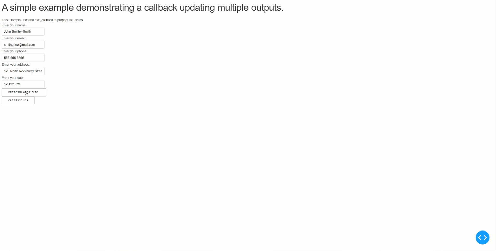

# West Health Dash Examples

This example utilizes the custom `dict_callback` decorator. It is meant to be used in situations where multiple dash components need updating in a single callback. In our experience with Dash, we have found this useful when creating Dash applications requiring the use of form elements and the need to prepopulate fields. The "vanilla" way of handling this prior to our `dict_callback` implementation was to return multiple outputs in our callback function. However, the elements returned needed to be in the exact order as they appear in the Ouput declaration to the callback. This `dict_callback` feature reduces this to a simple declaration of a dictionary keyed by component id + property. Below is a simple use case of using this decorator:

